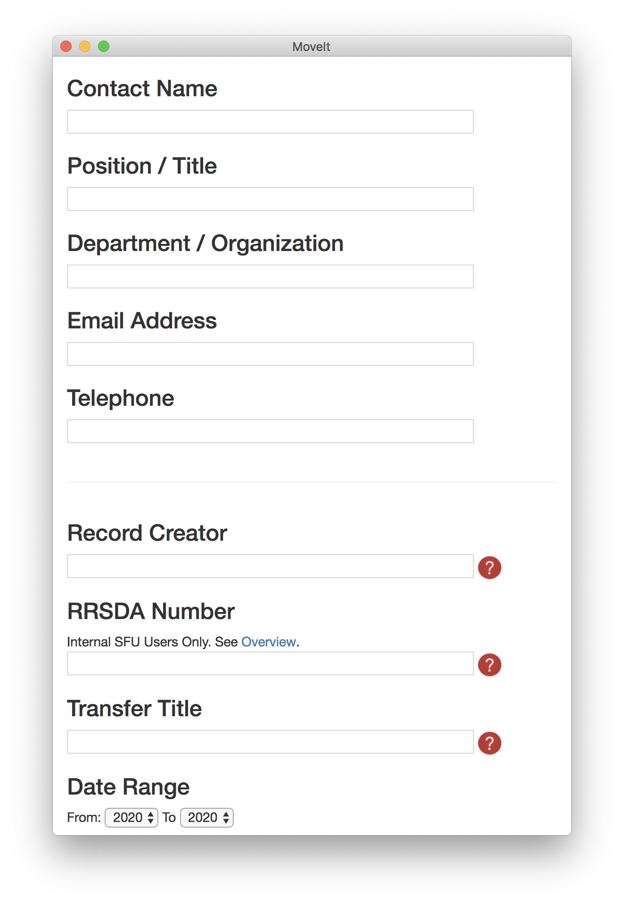

# MoveIt



This is MoveIt, a tool for building bag packages from files and folders on your desktop for transfer to repositories! The metadata fields entered into this app will be written into the bag's `bag-info.txt`. Right now, the compiled versions listed under the releases tab are customized for Simon Fraser University (as is one documentation link built into the app), but it's very easy to customize for your local context if you want.

User properties (those before the "jump" halfway down the app window) are automatically saved between runs and repopulated; bag-specific properties are not. Uses the Library of Congress' Python bagit library.

## Development
```
$ pip install -r requirements.txt --user
$ cd gui
$ npm install
$ npm start
```

## Building
The Python code needs to be built on its target platform using `pyinstaller`:

`pyinstaller -w moveit.py --distpath gui`

After building the crawler, the GUI can be built from the `gui` subdirectory with:

`electron-packager . --icon=resources/icon.ico` (Windows)

`electron-packager . --icon=resources/icon.icns` (Mac)

Finally, to package for install:

`electron-installer-windows --src moveit-win32-x64/ --dest install/ --config config.json` (Windows)

`hdiutil create tmp.dmg -ov -volname "MoveIt" -fs HFS+ -srcfolder moveit-darwin-x64/ && hdiutil convert tmp.dmg -format UDZO -o MoveIt.dmg && rm tmp.dmg` (Mac)
